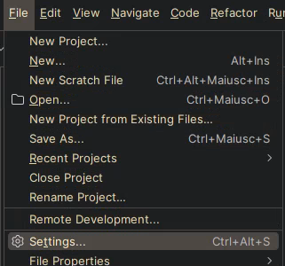
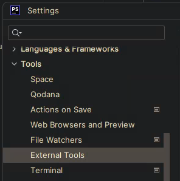
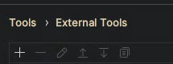
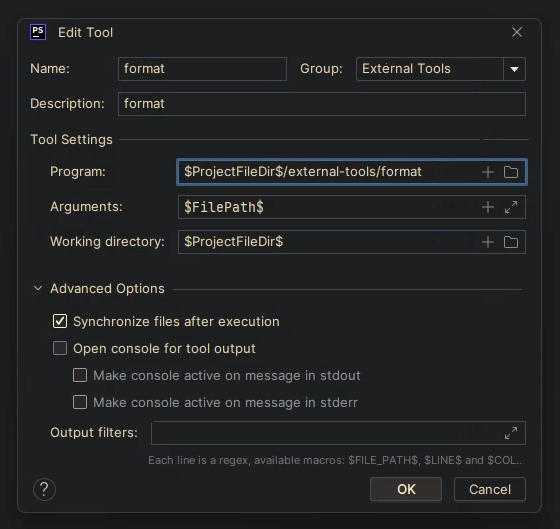
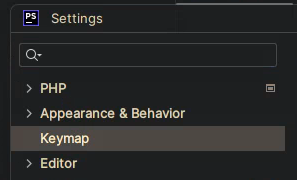
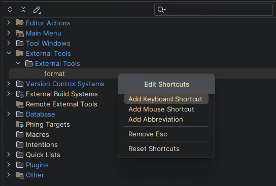

# Linting

Puoi eseguire il linting del codice sorgente php con
```sh
composer run lint
```

# PHP CS Fixer

Puoi formattare il codice sorgente php con

```sh
composer run format
```

> **Note** attenzione, [php-cs-fixer](https://github.com/PHP-CS-Fixer/PHP-CS-Fixer) attualmente non sopporta php `8.2`.<br/>
> Per adesso semplicemente ignoriamo l'incompatibilità con l'env `PHP_CS_FIXER_IGNORE_ENV=1`.<br/>
> Questo significa che dobbiamo evitare di usare le nuove feature di sintassi di `8.2` se vogliamo usare il cs-fixer.<br/>
> Elenco sintassi da evitare:
> - DNF Types
> - `readonly` modifier
> - `#[\SensitiveParameter]`
> - costanti in Trait
> 
> Per più informazioni leggi [l'articolo Stitcher](https://stitcher.io/blog/new-in-php-82).

> **Note** `8.2` è una release abbstanza nuova, il progetto [php-cs-fixer](https://github.com/PHP-CS-Fixer/PHP-CS-Fixer) ne implementerà il supporto a breve.<br/>
> Puoi seguire il bucket di issue [qui](https://github.com/PHP-CS-Fixer/PHP-CS-Fixer/issues?q=is%3Aissue+is%3Aopen+8.2+label%3Atopic%2FPHP8.2).<br/>


# PHP CS Fixer per VSCode

- Installa il plugin [Run On Save](https://marketplace.visualstudio.com/items?itemName=emeraldwalk.RunOnSave)
- Apri il file [settings.json](https://code.visualstudio.com/docs/getstarted/settings) \[[1](https://stackoverflow.com/questions/65908987/how-can-i-open-visual-studio-codes-settings-json-file)\] di VSCode
- Aggiungi la seguente configurazione
    ```json
    "emeraldwalk.runonsave": {
        "commands": [
            {
            "match": "(\\.php|bin/start)$",
            "cmd": "${workspaceFolder}/vendor/bin/php-cs-fixer fix ${file}"
            },
        ]
    }
    ```
  Questa configurazione eseguirà il format dei file php quando salvi.

# PHP CS Fixer per PHPStorm

Purtroppo PHPStorm non offre un controllo preciso dell'evento di salvataggio dei file, il comportamento predefinito è quello di salvare continuamente il file che stai modificando.

Perciò, a differenze di VSCode, il format del file attivo deve essere eseguito manualmente, premendo una combinazione di testi.

- Apri `File` > `Settings` > `Tools` > `External Tools`<br/>
  <br/>
  
- Aggiungi una nuova configurazione premendo il pulsante `+`<br/>
  
- Imposta la configurazione nel seguente modo
  - Name: `format`
  - Program: `$ProjectFileDir$/external-tools/format`
  - Arguments: `$FilePath$`
  - Working directory: `$ProjectFileDir$`
  - Open console for tool ouput: `false`<br/>
  
- Salva tutto
- Apri `File` > `Settings` > `Appearance & Behavior` > `Keymap`<br/>
  
- Modifica il bind `External Tools` > `External Tools` > `format` con `un tasto`/`una combinazione di tasti` che desideri<br/>
  

Al premere della combinazione scelta, il file attualmente in focus verrà formattato.
  
